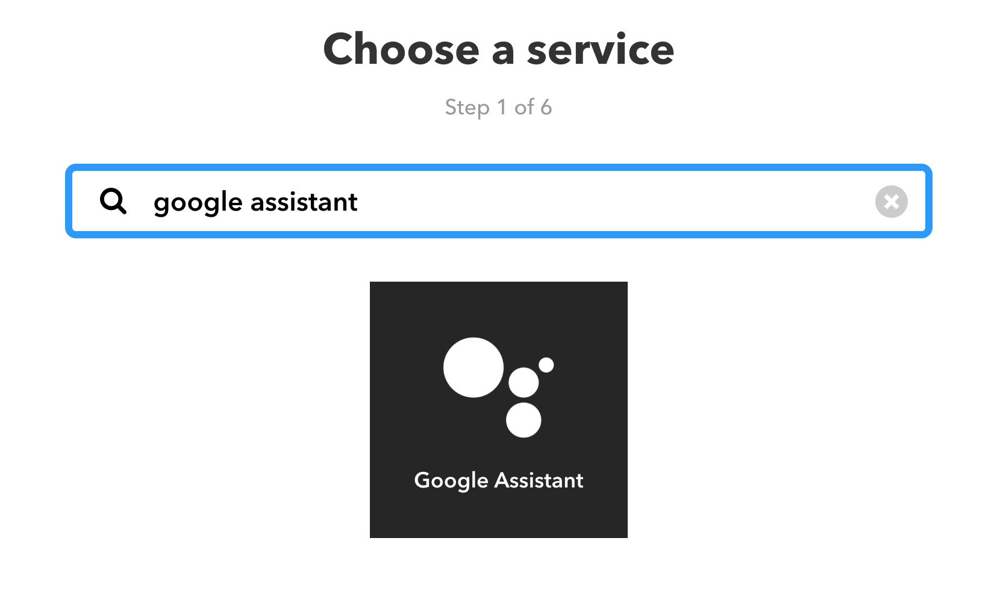
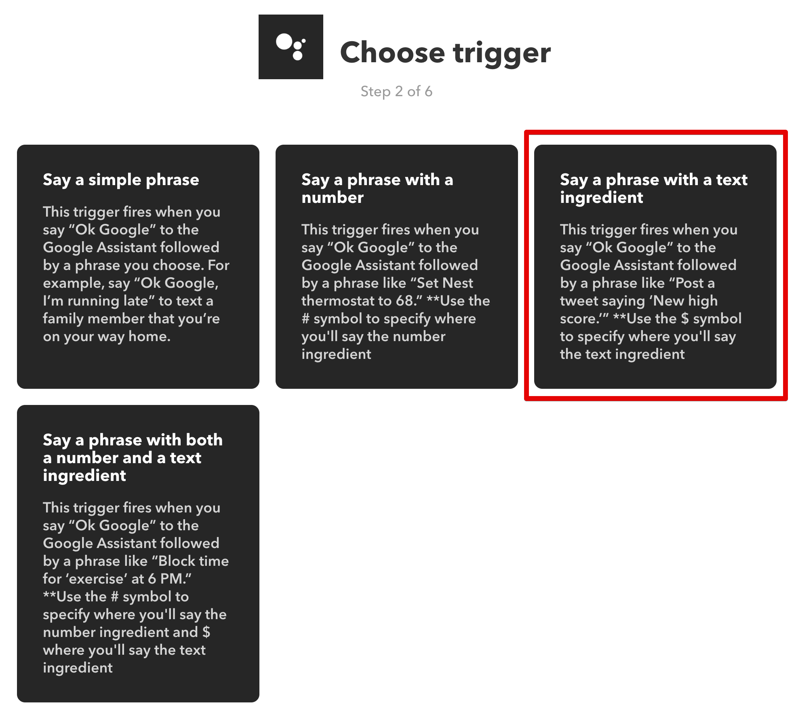
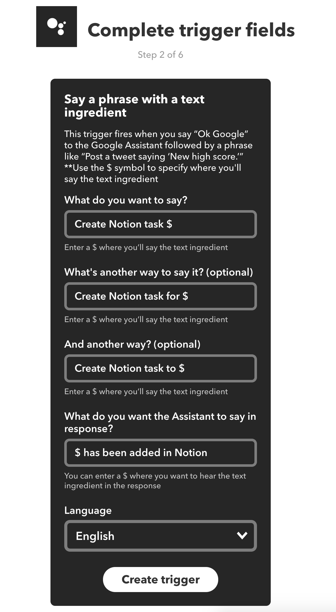

<h1 align="center">Welcome to notion-heroku 👋</h1>

  
  

> Heroku hosted application that performs [Notion](https://www.notion.so/) actions (i.e., new task, new note) based on voice requests via [IFTTT Webhooks](https://ifttt.com/maker_webhooks) and [Google Assistant](https://ifttt.com/google_assistant).

## Prerequisites

1. Have a [Notion](https://www.notion.so/) account
2. Have a [Heroku](https://heroku.com/) account
3. Have an [IFTTT](https://ifttt.com/) account (with Google Assistant service enabled)
4. Have [Specific Notion Template](https://www.notion.so/Week-Template-0a7ac4d03082417c929176b5ea1df07e) as described in [this blog post](https://kevinjalbert.com/my-weekly-notion-setup/)
5. Your Notion Token
6. URLs for Several Notion Object

## Install

_Note:_ The required environment variables mentioned in the below steps are outlined in [kevinjalbert/alfred-notion](https://github.com/kevinjalbert/alfred-notion)'s section on [finding your Notion Token](https://github.com/kevinjalbert/alfred-notion#finding-your-notion-token) and [finding your Notion URLs](https://github.com/kevinjalbert/alfred-notion#finding-your-notion-urls).

### With Heroku Deploy Button

1. Use above deploy button to create/launch application on [Heroku](https://heroku.com/)
2. Navigate to application settings page (i.e., https://dashboard.heroku.com/apps/your-notion-heroku/settings) and set required environment variables.

### Manually

1. Clone the repository via `git clone git@github.com:kevinjalbert/notion-heroku.git`
2. `heroku create`
3. `git push heroku master`
4. Set all required environment variables via `heroku config:set xxxx=yyyy`

### Setting up IFTTT Actions

Click to view walkthrough (images)

 

This walkthrough demonstrates how to setup a IFTTT action to add a Notion Task.

The main difference is that the webhook URL is either `/add_note` or `/add_task` in Step 6.

#### Step 1 - Choose _Trigger_ Service (Google Assistant)

#### Step 2 - Choose Google Assistant Trigger

#### Step 3 - Complete Google Assistant Trigger Fields

#### Step 4 - Choose _Action_ Service (Webhooks)

#### Step 5 - Choose Webhooks Action

#### Step 6 - Complete Webhook Action Fields

## Author

👤 **Kevin Jalbert**

* Twitter: [@kevinjalbert](https://twitter.com/kevinjalbert)
* Github: [@kevinjalbert](https://github.com/kevinjalbert)

## Show your support

Give a ⭐️ if this project helped you!

***
_This README was generated with ❤️ by [readme-md-generator](https://github.com/kefranabg/readme-md-generator)_
