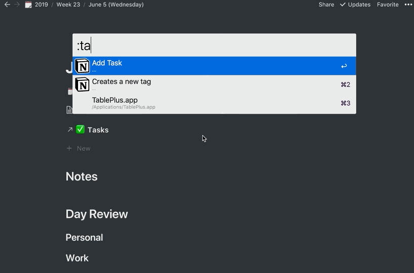
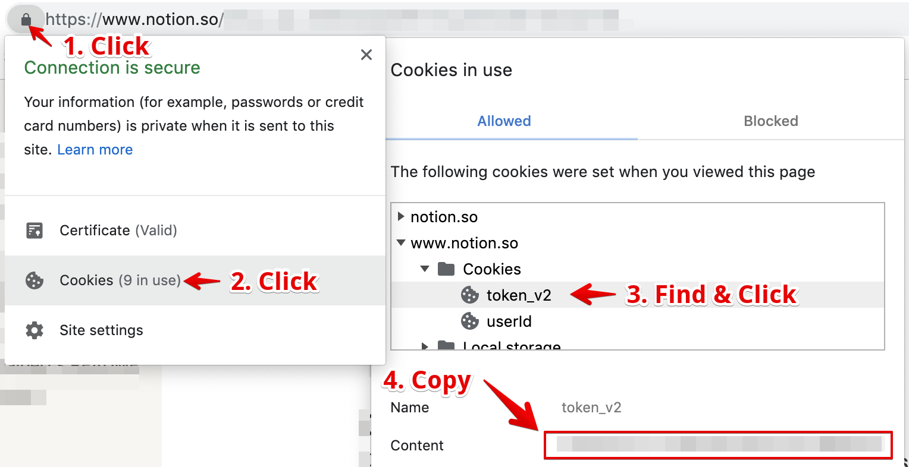

A tailored Alfred Workflow that performs tasks using [`notion-py`](https://github.com/jamalex/notion-py) within the context of a [specific Notion Template](https://www.notion.so/Week-Template-0a7ac4d03082417c929176b5ea1df07e) as described in [this blog post](https://kevinjalbert.com/my-weekly-notion-setup/).



# Setup

There is a bit of setup required to make this project work as intended.

1. Have a [Notion](https://www.notion.so/) account
2. Have [Alfred 4+](https://www.alfredapp.com/) with access to workflows (i.e., powerpack)
3. Have Python 3 installed on the system
4. Have [Specific Notion Template](https://www.notion.so/Week-Template-0a7ac4d03082417c929176b5ea1df07e) as described in [this blog post](https://kevinjalbert.com/my-weekly-notion-setup/)
5. Your Notion Token
6. URLs for Several Notion Object

## Install `alfred-notion`

### Get the workflow in Alfred

Create a _Blank Workflow_ and dump the contents of this sub-directory into it.


Another option is to symlink the repository's sub-directory into the workflow directory (paths will vary in the example depending on where things are located):

```
ln -s ~/path/to/notion-toolbox/alfred ~/path/to/Alfred.alfredpreferences/workflows/notion-toolbox-alfred
```

### Python

There are certain Python dependencies that are required for the scripts to work correctly. You need to navigate to the workflow's directory so that you can execute `pip3 install -r requirements.txt` from your terminal. Alternatively, you can manually install what is defined in the `./requirements.txt`.

## Finding your Notion Token

The first thing you'll need to do is get your _Notion Token_ (156 character value) from your browser's cookies. Depending on what browser you are using this process will vary slightly. The following diagram demonstrates how to find it using Chrome on MacOS.



## Finding your Notion URLs

We need to identify the _Notion URLs_ for the:

- Tags Database
- Wins Database
- Tasks Database
- Year Page

These are can be acquired by finding the correct resource in your Notion and using the _Copy Link_ found in the context menu (i.e., right click or the left-clicking `...`).

## Configure Data Files

Given the information we've taken note of in the last 2 sections, we can now configure our data files.

1. Find `./data/tags.sample.json`, and rename to `./data/tags.json`.
2. Find `./data/config.sample.json`, and rename to `./data/config.json`.
3. Fill the value out in `./data/config.json` with the Notion Token and Notion URLs:

```
  {
    "NOTION_TOKEN": "your-notion-token",
    "TAGS_DATABASE_URL": "your-notion-tags-database-url",
    "TASKS_DATABASE_URL": "your-notion-tasks-database-url",
    "WINS_DATABASE_URL": "your-notion-wins-database-url",
    "YEAR_PAGE_URL": "your-notion-year-page-url",
    "WEEK_STARTS_ON_SUNDAY": true,
    "CUSTOM_DAY_FORMAT": "strftime-day-format-inside-days-column"
  }
```

_Note:_ I know that this is a rather unconventional approach for configurations with an Alfred workflow, but it is what worked best for me. Later on, I might switch it up to something more conventional.

# Features

## Navigation

### :week

This keyword will open Notion to the current week.

- The week page needs to exist.
- Notion will become the forefront application and will open the current week.
- After Notion opens, you lose the history (i.e., ability to go back) of that Notion's session. History works afterwards.

### :day

This keyword will open Notion to the current day.

- The day page needs to exist under the current week.
- Notion will become the forefront application and will open the current day.
- After Notion opens, you lose the history (i.e., ability to go back) of that Notion's session. History works afterwards.

## Tags

### :tag

This keyword allows you to create a new tag in your tags database.

- After the tag has been added, a secondary action will run `:update`), updating the locally cached data file holding our tags.
- You will likely want to add an icon after the fact on the newly added tag.

### :update

This keyword allows you to update your local tags data file with what your database has.

- This is done so we have a local cache to speed things up.
- After making a new tag, this is done this automatically.

## Wins

### :win

This keyword allows you to create a new win in your wins database.

- You can optionally open the Notion page for this win if you `cmd + enter` when entering the title.
  - After Notion opens, you lose the history (i.e., ability to go back) of that Notion's session. History works afterwards.
- After entering the win's title you will be able to add multiple tags.
  - You can finish adding tags by selecting the `Done` option.

## Tasks

### :task

This keyword allows you to create a new task in your tasks database.

- You can optionally open the Notion page for this task if you `cmd + enter` when entering the title.
  - Notion will become the forefront application.
  - After Notion opens, you lose the history (i.e., ability to go back) of that Notion's session. History works afterwards.
- After entering the task's title you will be able to add multiple tags.
  - You can finish adding tags by selecting the `Done` option.
- After entering the task's tags you can select the status.

### :search

This keyword allows you to search your tasks, and be able to open it in Notion or change its status.

- Search results are based on the view of the `TASKS_DATABASE_URL`.
  - Ideally, you would have this being a view on the master task database that matches the filters of your current day's _Linked Database_ of tasks. This little optimization is done for speed reasons.
- Searches the word boundaries of title/tags/status of a task.
- When selecting a task it will open its Notion page.
  - Notion will become the forefront application.
  - After Notion opens, you lose the history (i.e., ability to go back) of that Notion's session. History works afterwards.
- You can optionally select the task with `cmd + enter` to change its status.
  - If the status changes to `Completed` the `Completed On` attribute of the task will be updated to the current time.

## Notes

### :note

This keyword allows you to append a text block at the end of your current day's notes section.
