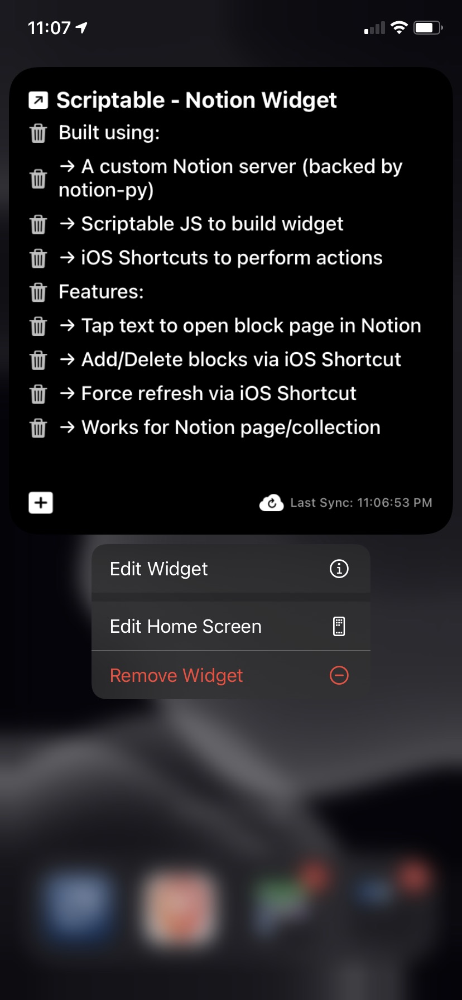

# Scriptable -- Notion Block View

This is a [Scriptable](https://scriptable.app/) widget that provides basic functionality for viewing/creating/deleting Notion blocks using iOS Shortcuts.

# Demo

I announced and released this on [my blog in this article](https://kevinjalbert.com/custom-notion-ios-widget/). A full demo of the widget is presented in the following YouTube video.

      

## Installation

To use this widget you have to do the following:

1. Acquire your `token_v2` from [Notion's web application](https://www.notion.so/).

2. (Optional) have your own [notion-toolbox server](../server) running (if the security concern of sending your token to my server scares you)

3. Install [Scriptable](https://scriptable.app/) on your iOS device

4. Install [Data Jar](https://datajar.app/) on iOS your iOS device (this is optional if you want to hardcode the notion token in the iOS Shortcuts) and put the `token_v2` value under a new `notion_token` text key.

5. Create a new script (`Notion Block View`) in Scriptable with the contents in this [file](./Notion%20Block%20View.js) and replace the `NOTION_TOKEN` with your `token_v2` value (and maybe the server url if you decided to use your own)

6. Add a Scriptable widget on your homescreen in iOS

    6a. Configure the widget's _Script_ to be `Notion Block View`

    6b. Configure the widget's _When Interacting_ to be `Run Script`

    6c. Configure the widget's _Parameter_ to be a Notion link for a page/collection

7. Create the following iOS Shortcuts on your device (names are important and case-sensitive), you might have to change some things based on the server URL and usage of Data Jar:

    7a. [Append to Notion Block (image)](./images/shortcut-append.jpeg)

    7b. [Delete Notion Block (image)](./images/shortcut-delete.jpeg)

    7c. [Refresh Notion Block (image)](./images/shortcut-refresh.jpeg)

8. Enjoy
