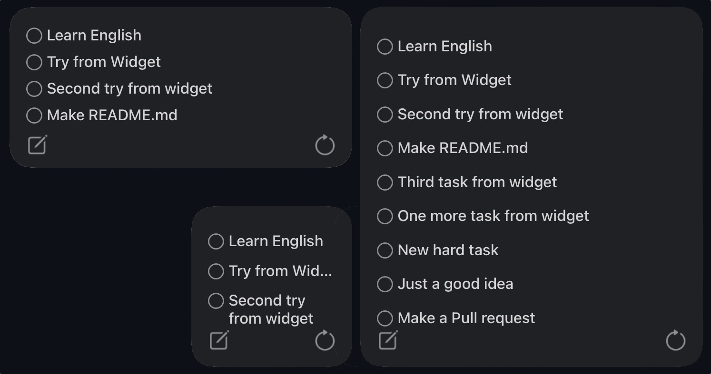

# Scriptable -- Notion Block View

This is a [Scriptable](https://scriptable.app/) widget that provides basic functionality for viewing/creating/deleting Notion blocks using iOS Shortcuts.

# Demo

# Описание

В данном репозитории содержится код и краткая инструкция для создания виджета наполянемого данными из вашей базы даных в Notion.

Scriptable автоматически обновляет информацию внутри виджета каждые 5-7 минут.

Краткое описание возможностей виджета:

1. **Не занятые элементами места виджета** — при нажатии запускают ветку основного скрипта, которая запускает приложение Notion
2. **Текстовые строки** — Содержат в себе текст из одного из полей вашей БД Notion. При нажатии на текст вызывается ветка основного скрипта, который открывает соответствующую страницу в Notion
3. **Круг** **перед каждой записью** - вызывает скрипт который переводит задачу в конечный статус (например: Done)
4. **Квадрат с ручкой** - Кнопка вызывает Alert, с помощью которого можно создать задачу в начальном статусе.
5. **Круглая стрелка** - Принудительно обновляет виджет.

# Инсталляция

1. Создать новую базу данных или использовать мой шаблон ([https://gskirda.notion.site/77bcd7e231d84566a2959e6abea33c2d?v=9f73f111ff914383bc3e6b50a1fae180](https://www.notion.so/77bcd7e231d84566a2959e6abea33c2d)). 
    1. Стоит понимать, что база данных может иметь:
        1. Другую структуру
        2. Другие имена полей
        3. Имена статусов
        4. И тд.
    2. Для этого нужно будет изменить соответствующие строки в коде скриптов.
2. Проделать шаги из данной инструкции ([https://developers.notion.com/docs](https://developers.notion.com/docs))
    1. На этом шаге важно сохранить 
        1. Ваш API Token
        2. Ваш Database ID
3. Установить Scriptable из App Store
4. Создать в Scriptable 3 скрипта (names are important and case-sensitive)
    1. to-do
    2. done_task
    3. new_task
5. Перейти в скрипт to_do и вставить ваш API Token Notion
6. Добавить виджет 
    1. Вызвать меню изменения виджета и указать следующие параметры
        1. Script: to_do
        2. When interacting: Run Script
        3. Parameter: [Ваш Database ID]
    2. Нажать Готово
7. Через несколько секунд виджет обновится и отобразит страницы из вашей базы данных Notion
I announced and released this on [my blog in this article](https://kevinjalbert.com/custom-notion-ios-widget/). A full demo of the widget is presented in the following YouTube video.

      

## Installation

To use this widget you have to do the following:

1. Acquire your `token_v2` from [Notion's web application](https://www.notion.so/).

2. (Optional) have your own [notion-toolbox server](../server) running (if the security concern of sending your token to my server scares you)

3. Install [Scriptable](https://scriptable.app/) on your iOS device

4. Install [Data Jar](https://datajar.app/) on iOS your iOS device (this is optional if you want to hardcode the notion token in the iOS Shortcuts) and put the `token_v2` value under a new `notion_token` text key.

5. Create a new script (`Notion Block View`) in Scriptable with the contents in this [file](./Notion%20Block%20View.js) and replace the `NOTION_TOKEN` with your `token_v2` value (and maybe the server url if you decided to use your own)

6. Add a Scriptable widget on your homescreen in iOS

    6a. Configure the widget's _Script_ to be `Notion Block View`

    6b. Configure the widget's _When Interacting_ to be `Run Script`

    6c. Configure the widget's _Parameter_ to be a Notion link for a page/collection

7. Create the following iOS Shortcuts on your device (names are important and case-sensitive), you might have to change some things based on the server URL and usage of Data Jar:

    7a. [Append to Notion Block (image)](./images/shortcut-append.jpeg)

    7b. [Delete Notion Block (image)](./images/shortcut-delete.jpeg)

    7c. [Refresh Notion Block (image)](./images/shortcut-refresh.jpeg)

8. Enjoy
